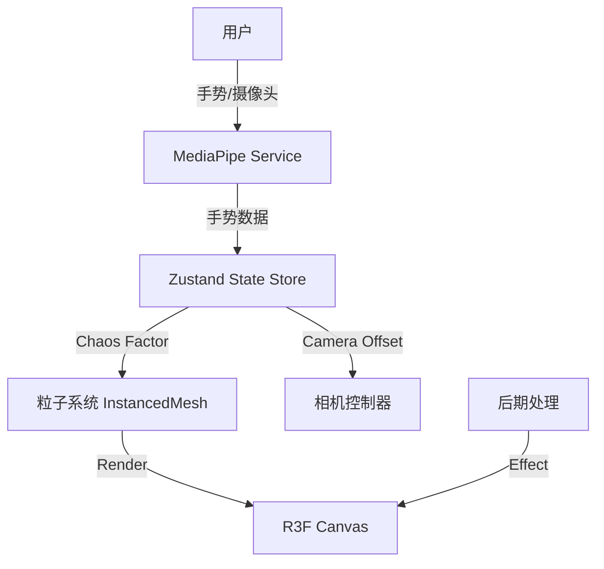

## 产品概述

构建一个基于 React 19 和 React Three Fiber (R3F) 的“奢华互动圣诞树”Web 应用。该应用将结合电影级的视觉效果与先进的手势交互，为用户提供一种高端、沉浸式的节日体验。

## 核心功能

- **沉浸式 3D 场景**：使用 R3F 渲染，配置 [0, 4, 20] 相机视角与 Lobby HDRI 环境光，营造奢华大厅氛围。
- **双坐标粒子系统**：粒子具有“混沌”与“聚合”两种状态。
- **Unleash (张手)**：粒子飞散，进入混沌状态。
- **Formed (握拳)**：粒子聚合，组成圣诞树形态。
- **手势交互控制**：集成 MediaPipe 手势识别。
- **手势开合**：控制粒子系统的混沌/聚合插值权重。
- **手势移动**：控制相机的轻微视差运动，增强深度感。
- **奢华视觉风格**：采用“祖母绿 (Emerald)”与“鎏金 (Gold)”配色，配合 Postprocessing 的 Bloom 辉光效果，打造特朗普式奢华感。
- **个性化装饰**：树上悬挂拍立得风格照片，增加互动细节。

## 技术栈

- **核心框架**: React 19, TypeScript
- **3D 引擎**: React Three Fiber (R3F), Drei (辅助库)
- **样式方案**: Tailwind CSS
- **视觉算法**: MediaPipe Tasks Vision (手势识别)
- **后期处理**: @react-three/postprocessing (Bloom, Depth of Field)
- **数学/动画**: Maath (平滑插值)

## 架构设计

### 系统架构

### 核心模块

1. **GestureManager**: 负责加载 MediaPipe 模型，实时检测手部关键点，计算“张开度”与“位置偏移”。
2. **ParticleEngine**: 管理数千个粒子的 InstanceMesh。

- Shader Material: 接收 `uChaosFactor`，在 Vertex Shader 中混合 `targetPos` (树形) 与 `chaosPos` (随机)。

3. **SceneGraph**: 包含环境光 (Environment)、装饰物 (Polaroids) 和主相机 (CameraRig)。
4. **UI Overlay**: 覆盖在 Canvas 之上的 HUD，显示操作指引或加载状态。

### 数据流

## 设计风格

采用“Grand Luxury（宏大奢华）”设计语言。视觉重心在于材质的高级感与光影的戏剧性。

- **界面 (UI)**：极简主义，使用纤细的衬线字体与半透明磨砂玻璃 (Glassmorphism) 背景，避免干扰 3D 主体。
- **3D 场景**：
- **材质**：高反射率的金属金、深邃的祖母绿丝绒质感。
- **光效**：暖色调的体积光，强调 Bloom 辉光，模拟高端百货橱窗的节日氛围。
- **动效**：粒子运动需带有物理惯性，类似流体或星尘，而非僵硬的线性移动。

# Agent Extensions

- **code-explorer** (from <subagent>)
- Purpose: 扫描当前目录结构，确认是否已有 React/Vite 基础代码，避免重复创建或覆盖重要文件。
- Expected outcome: 获得项目文件列表，确定下一步是新建项目还是在现有代码上开发。