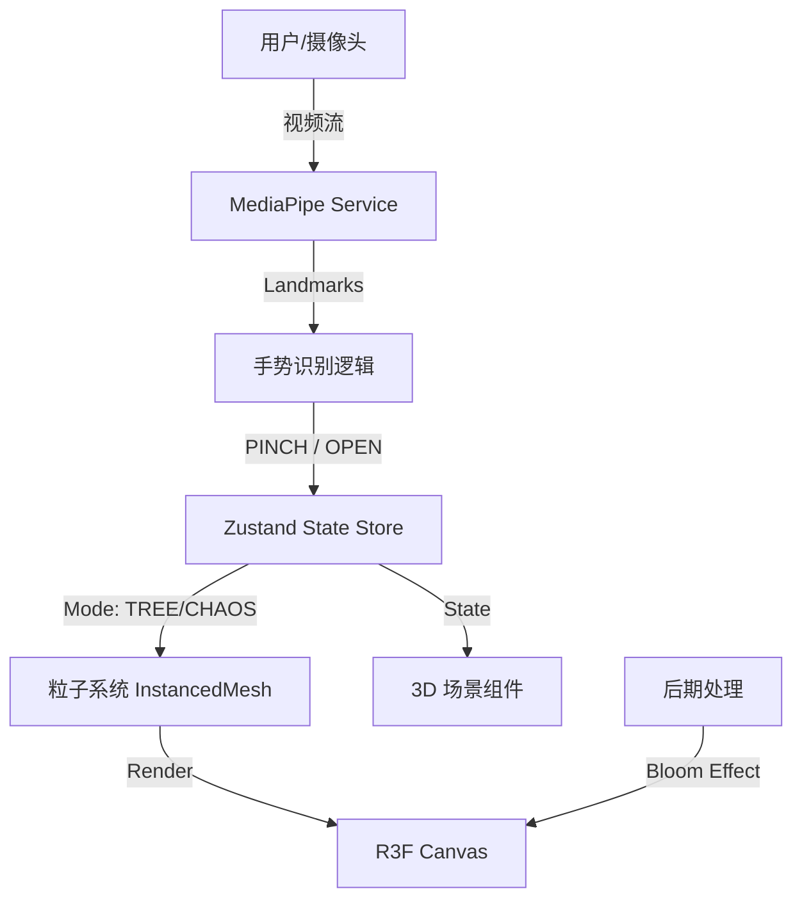

# 🎄 奢华互动圣诞树 (Luxury Interactive Christmas Tree)

构建一个基于 React 18 和 React Three Fiber (R3F) 的“奢华互动圣诞树”Web 应用。该应用结合了电影级的视觉效果与先进的手势交互，为用户提供一种高端、沉浸式的节日体验。

## ✨ 核心功能

### 1. 沉浸式 3D 场景
- 使用 **React Three Fiber** 渲染，配置 Lobby HDRI 环境光，营造奢华大厅氛围。
- **双状态粒子系统**：20,000 个粒子构成的动态系统，具有“混沌 (Chaos)”与“聚合 (Tree)”两种状态。
- **自定义 Shader**：实现粒子的呼吸动画、大小衰减与 Disney 风格的辉光效果。

### 2. 魔法手势交互
集成 **MediaPipe** 手势识别，通过摄像头实时捕捉手部动作：
- **PINCH (捏合)**：魔法聚合 —— 粒子从混沌状态汇聚成一棵璀璨的圣诞树。
- **OPEN (张开)**：释放能量 —— 粒子飞散，回归银河般的混沌状态。
- **平滑过渡**：使用 **Maath** 库实现粒子位置的物理平滑插值。

### 3. 奢华视觉风格
- **配色**：采用“Rich Pine Green (深松绿)”与“Gold (流金)”为主色调。
- **特效**：使用 **Postprocessing** 的 Bloom (辉光) 效果，模拟高端百货橱窗的节日氛围。
- **丰富细节**：
  - ❄️ 动态飘雪 (Snow)
  - 🎁 奢华礼盒 (Luxury Gifts)
  - 🍬 糖果与拐杖糖 (Candies & Candy Canes)
  - ✨ 极光光带 (Aurora Bands)
  - 🌟 顶部闪耀之星 (Star)

### 4. 个性化记忆
- **照片墙装饰**：自动读取 `src/assets/photos` 目录下的照片。
- **动态悬挂**：将照片以拍立得风格相框的形式，随机或规律地悬挂在圣诞树上，随树旋转。

## 🛠 技术栈

- **核心框架**: [React 18](https://react.dev/), [TypeScript](https://www.typescriptlang.org/)
- **构建工具**: [Vite](https://vitejs.dev/)
- **3D 引擎**: [React Three Fiber](https://docs.pmnd.rs/react-three-fiber), [Drei](https://github.com/pmndrs/drei)
- **视觉算法**: [MediaPipe Tasks Vision](https://developers.google.com/mediapipe) (手势识别)
- **状态管理**: [Zustand](https://github.com/pmndrs/zustand)
- **样式方案**: [Tailwind CSS](https://tailwindcss.com/)
- **后期处理**: [@react-three/postprocessing](https://github.com/pmndrs/react-postprocessing)
- **数学/动画**: [Maath](https://github.com/pmndrs/maath)

## 🏗 架构设计

### 系统数据流



### 核心模块

1.  **Scene (场景)**:
    *   `Experience.tsx`: 场景入口，组装所有 3D 元素。
    *   `Particles.tsx`: 核心粒子系统，包含自定义 Vertex/Fragment Shader。
    *   `Decorations.tsx`: 管理照片墙装饰的分布与渲染。

2.  **Interaction (交互)**:
    *   `useHandLandmarker.ts`: 封装 MediaPipe 模型加载与检测循环。
    *   `gesture.ts`: 解析手部关键点，判断 PINCH/OPEN 手势。
    *   `useStore.ts`: 全局状态管理 (Started, HandDetected, Gesture, Mode)。

3.  **Visuals (视觉)**:
    *   包含 Snow, AuroraBands, BackgroundSparkles 等氛围组件。

## 🚀 快速开始

1.  **安装依赖**:
    ```bash
    npm install
    ```

2.  **启动开发服务器**:
    ```bash
    npm run dev
    ```

3.  **添加照片**:
    将你的 `.jpg`, `.png` 或 `.webp` 照片放入 `src/assets/photos/` 目录，它们会自动出现在圣诞树上。

## 🎨 设计理念

采用 **"Grand Luxury (宏大奢华)"** 设计语言。
*   **材质**：高反射率的金属金、深邃的祖母绿丝绒质感。
*   **光效**：暖色调的体积光，强调 Bloom 辉光。
*   **动效**：粒子运动带有物理惯性，类似流体或星尘，而非僵硬的线性移动。

---
*Created with ❤️ for Christmas*
